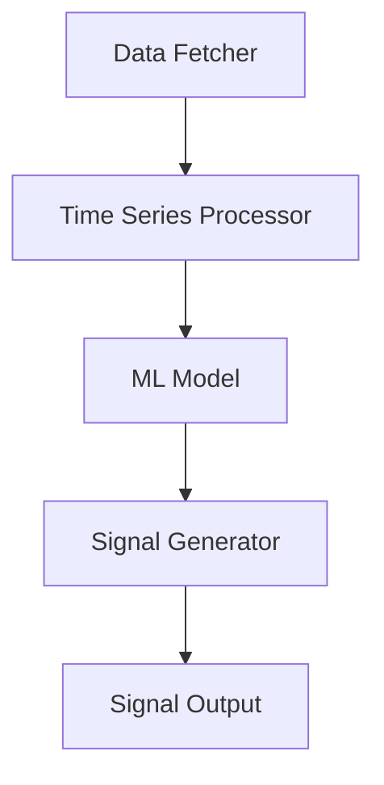

# Core Components

The Gold Futures Signal Trading Generator consists of several key components that work together to analyze market data and generate trading signals.

## Architecture Overview

## Components Description

### 1. Data Fetcher
- Retrieves historical and real-time gold futures data
- Handles API connections and data caching
- Manages rate limiting and error handling

### 2. Time Series Processor
- Cleans and normalizes raw market data
- Calculates technical indicators
- Prepares feature vectors for the ML model

### 3. Machine Learning Model
- Analyzes processed data using ensemble methods
- Uses LSTM networks for time series prediction
- Maintains model versioning and updates

### 4. Signal Generator
- Interprets model outputs
- Applies risk management rules
- Generates actionable trading signals

### 5. Signal Output
- Formats signals for different platforms
- Provides real-time notifications
- Maintains signal history

## Key Features

- Real-time signal generation
- Multiple timeframe analysis
- Risk management integration
- Performance tracking
- API integration capabilities

## Signal Types

The system generates the following types of signals:

| Signal Type | Description |
|------------|-------------|
| STRONG_BUY | High confidence bullish signal |
| BUY | Moderate confidence bullish signal |
| NEUTRAL | No clear directional bias |
| SELL | Moderate confidence bearish signal |
| STRONG_SELL | High confidence bearish signal |

See the [API Documentation](/docs/api) for detailed signal format specifications.
